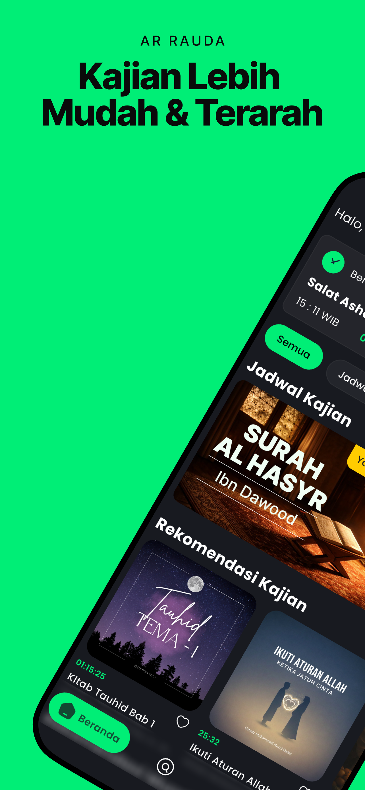
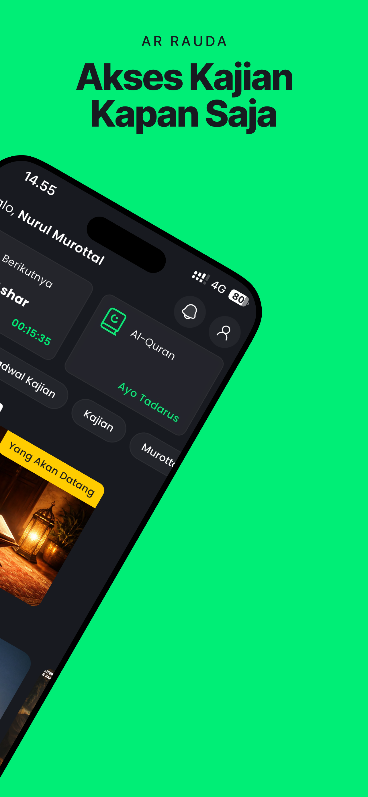
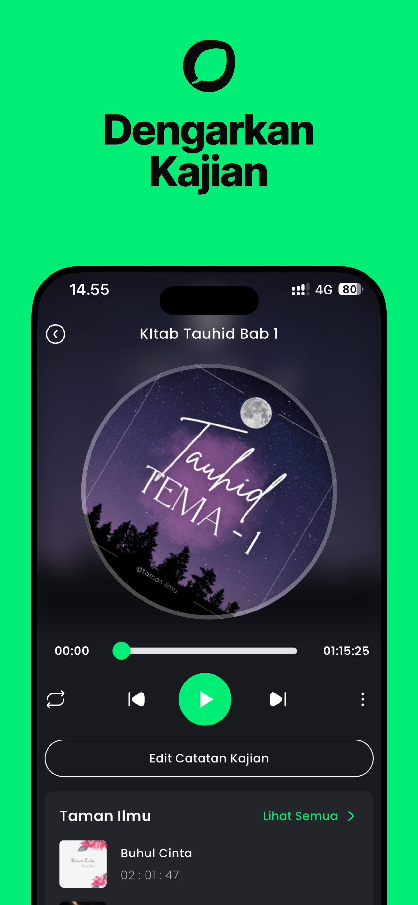
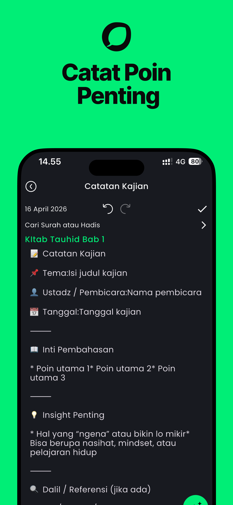
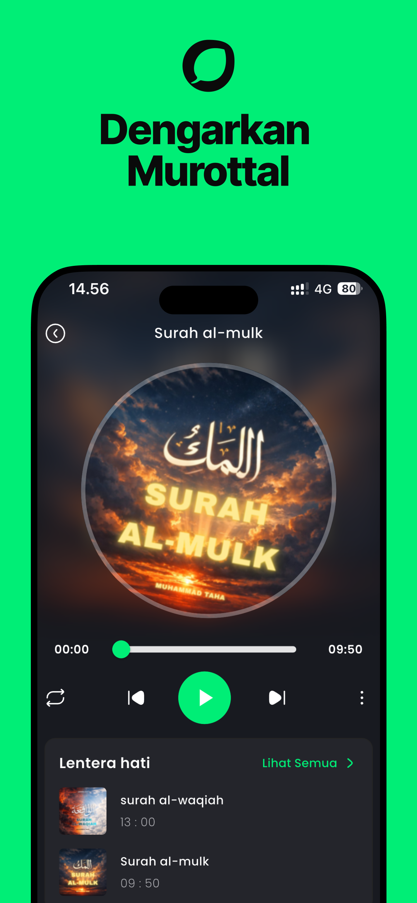

# MayudevID - Maulana Yusuf

Personal brand for my work and journey as a Mobile Developer, focused on Android and iOS app development using Flutter and native technology integrations.

- Location: South Tangerang
- Email: [ymaulana089@gmail.com](mailto:ymaulana089@gmail.com)
- Phone: [+62 858-1159-1353](tel:+6285811591353)
- LinkedIn: [linkedin.com/in/maulana-yusuf-b87393201](https://www.linkedin.com/in/maulana-yusuf-b87393201)
- GitHub: [github.com/mayudevID](https://github.com/mayudevID)

---

## About Me

Mobile Developer with a bachelor's degree in Information Systems and experience building, improving, and maintaining Android and iOS applications using Flutter and native technology integrations. Experienced in user interface implementation, API integration, state management, and application deployment.

My main focus areas are:

- End-to-end feature development in mobile applications
- API integration, data management, and state management
- App quality, performance, and release stability

---

## Experience

### Staff Mobile Programmer
**PT Kreasindo Karya Abadi** | May 2024 - Apr 2026

- Developed Android and iOS mobile applications using Flutter and Dart
- Built and implemented features across 3 complex mobile applications, including 1 production application:
	- API integration
	- Data management
	- Liveness detection (face detection)
	- Chat and voice/video calls (LiveKit, CallKit iOS)
	- Real-time notifications (FCM)
	- AR filters (Augmented Reality)
	- Payment system
- Contributed to community app stability with an error rate around 1.03% and a 4.03/5 rating
- Supported daily active user growth up to an average of 12 thousand users in April 2025

### Flutter Mobile Developer - Internship
**PT Suitmedia Kreasi Indonesia** | Feb 2023 - Jun 2023

- Contributed to mobile application development using Flutter and Dart, focusing on user interface implementation and application functionality
- Managed source code with Git and collaborated through version control workflows
- Participated in feature implementation, bug fixing, and application testing
- Communicated with the team to discuss project requirements, resolve technical issues, and report progress

---

## Education

### Universitas Pembangunan Nasional Veteran Jakarta
Bachelor of Information Systems, GPA 3.95/4.00 | Sep 2020 - Jul 2024

- Study focus:
	- Logical, analytical, and algorithmic problem-solving
	- Web and mobile information system development
	- Machine learning fundamentals and data analysis
	- System analysis and design using DFD, ERD, and UML
	- System documentation and requirements specifications

---

## Skills

### Hard Skills

- Flutter (Dart)
- Android and iOS development tools
- Version control: Git, GitHub, GitLab
- IDE: VS Code, Xcode, Android Studio
- CI/CD: Fastlane, Codemagic

### Soft Skills

- Problem-solving
- Critical thinking
- Communication
- Teamwork

---

## Certifications and Training

- Menjadi Android Developer Expert - Dicoding (2022)
- Menjadi Flutter Developer Expert - Dicoding (2022)

---

## Featured Projects

### 1. Ar-Rauda - Islamic Studies and Qur'an Murottal

Ar-Rauda is an Islamic studies app that provides Qur'an murottal collections, lectures, and other religious learning materials.

**Main Features**

- Islamic studies and Qur'an murottal
- Listen to lectures together
- Live-streamed lectures
- Create lecture notes
- Prayer notifications and reminders
- Read the Qur'an and tajwid
- Morning and evening dhikr
- Islamic learning roadmap (structured materials)

	
	
	
	
	

Available on Google Play and App Store

  

  

### 2. Bloom - Productivity App

Bloom is a daily productivity app with To-do List, Pomodoro Timer, Habit Tracker, and notification-based reminder features.

**Core Stack**

- Flutter (Dart)
- Firebase: Auth, Firestore, Storage, Analytics

**Architecture & Engineering**

- State management: BLoC (`bloc`, `flutter_bloc`) + GetX (`get`) in selected flows
- Model/data layer: `equatable`, `dartz`, `json_serializable`, `json_annotation`
- Offline persistence: `shared_preferences`
- Network awareness: `connectivity_plus`

Repository: [github.com/mayudevID/bloom](https://github.com/mayudevID/bloom)

### 3. Cling! - Money Management App

Cling! is a money management app for tracking income and expenses, budgeting, and monitoring financial condition.

**Core Stack**

- Flutter (Dart)
- Firebase: Auth, Firestore, Storage, Messaging, Crashlytics, Analytics

**Architecture & Engineering**

- State management: BLoC (`bloc`, `flutter_bloc`)
- Dependency injection: `get_it`
- Local database: `sqflite`
- Local key-value storage: `shared_preferences`
- Network awareness: `connectivity_plus`

Repository: [github.com/mayudevID/cling](https://github.com/mayudevID/cling)

### 4. KBBI Daring App

Android app for online KBBI vocabulary search powered by an API.

**Core Stack**

- Kotlin + Android SDK (minSdk 21, targetSdk 33)
- Retrofit + Gson converter for API consumption

**Architecture & Engineering**

- Local data layer: Room (`room-runtime`, `room-ktx`) + `kapt`
- Async programming: Kotlin Coroutines (`kotlinx-coroutines-android`)
- Screen navigation: AndroidX Navigation (`navigation-fragment-ktx`, `navigation-ui-ktx`)

Repository: [github.com/mayudevID/kbbi_daring_app](https://github.com/mayudevID/kbbi_daring_app)

---

## Contact

Open to collaboration and full-time work opportunities in Mobile Development.

- Email: [ymaulana089@gmail.com](mailto:ymaulana089@gmail.com)
- LinkedIn: [linkedin.com/in/maulana-yusuf-b87393201](https://www.linkedin.com/in/maulana-yusuf-b87393201)
- GitHub: [github.com/mayudevID](https://github.com/mayudevID)
